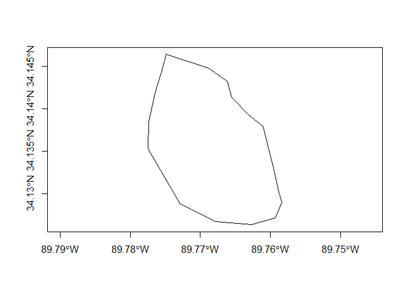
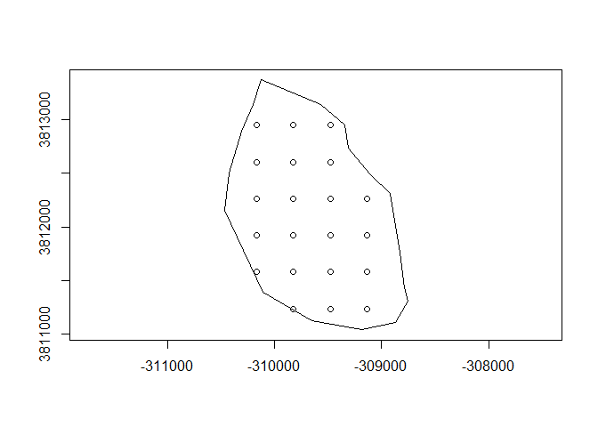

# Spatial polygons

<!--
rmarkdown::render("2018-12-15-making-a-spatial-polygon.Rmd")
-->


Generating sampling points in a polygon, like a lake can be done in 
R. Alternatively it can be done in a GIS like ARCgis, but I find that
I use GIS so infrequently that I often forget how to do all the mouse
clicks to replicate the process. Additionally, folks may not have access
to tools like ARCgis. 

Setting up sampling locations on a lake is something we commonly do and this 
script outlines the code needed to

1. Convert a series of coordinates to a projected polygon,
2. Do a spatial transformation of the polygon to different coordinate system, and
3. Put a grid of points down on the polygon. 


First we are going to need the `sp` package.


```r
library(sp) 
```

Now we need some coordinates that represent the polygon. In some cases these 
can be mapped by a person from an existing shapefile 
or in many cases I make a polygon in Google Earth and then extract the coordinates
from the KML or KMZ file. The inputs needed are the lattitude and longitude in 
decimal degress in a 2 column matrix. 


```r
xy<-matrix(c(	
	-89.77289828816011,34.12873397365311,
	-89.76774994101028,34.12668478124235,
	-89.76266944254215,34.12628818013323,
	-89.75931113396815,34.12712965948358,
	-89.75832500358763,34.12898146027732,
	-89.75875790900869,34.13012770412038,
	-89.75956198837545,34.13306528303878,
	-89.76032752522802,34.13562525651049,
	-89.76099817993331,34.13790799169687,
	-89.76312565910443,34.13926482932697, 
	-89.76556160304746,34.14136708399852,
	-89.76617598985348,34.14324607146693,
	-89.76878432735586,34.14479967335202,
	-89.77492333746093,34.14640413252697,
	-89.77555592736375,34.14431798895685,
	-89.77643367333054,34.14200220172483,
	-89.77738235493442,34.13842937845001,
	-89.77747288929112,34.13526043231848,
	-89.77289828816011,34.12873397365311),
		ncol=2, byrow=TRUE)	
```

Note that the first and last rows of the matrix must be the same. 

Let's check and make sure


```r
xy[1,] ## first row
```

```
## [1] -89.77290  34.12873
```

```r
xy[nrow(xy),] ## last row
```

```
## [1] -89.77290  34.12873
```
We can use R to make sure.


```r
xy[1,] == xy[nrow(xy),]
```

```
## [1] TRUE TRUE
```

Yep the first and last rows are the same, the polygon will be closed.


Now using the `Polygon()` function to make a polygon from the coordinates.


```r
xy<- Polygon(xy)
```

Now the `SpatialPolygons()` function requires a list of polygons. In this case we
only have one polygon, but if you had more than 1 this function will do it. 


```r
xy<- Polygons(list(Polygon(xy)), ID=1)
```
The code above makes a list of polygons with some meta data, an ID in this 
case for each polygon.

Now the`SpatialPolygons()` function take the list of polygons and 
defines the spatial projection.


```r
## MAKE THE COORDINATES INTO A POLYGON   
xy <- SpatialPolygons(list(xy),
	proj4string=CRS("+proj=longlat +datum=NAD83"))
```

Now you can do nice things like plot the polygon.


```r
plot(xy,axes=TRUE)
```

<!-- -->

You can even work among different projection systems.
The code below projects the polygon to UTM zone 16. 


```r
xy_utm<-spTransform(xy, 
    CRS("+proj=utm +zone=17 +datum=NAD83"))
```

Using the `spsample()` function you can sample the polygon in varying
ways, below is a regular sample from a random initial location.


```r
xy.points.reg <- spsample(xy_utm, n = 23, type = "regular") # n is sample size
```
You can look at the sites on the lake.


```r
plot(xy_utm,axes=TRUE)
points(xy.points.reg)
```

<!-- -->

You can also look at the xy coordinates and upload them to your GPS!


```r
xy.points.reg
```

```
## SpatialPoints:
##              x1      x2
##  [1,] -309823.6 3811234
##  [2,] -309480.4 3811234
##  [3,] -309137.2 3811234
##  [4,] -310166.8 3811577
##  [5,] -309823.6 3811577
##  [6,] -309480.4 3811577
##  [7,] -309137.2 3811577
##  [8,] -310166.8 3811920
##  [9,] -309823.6 3811920
## [10,] -309480.4 3811920
## [11,] -309137.2 3811920
## [12,] -310166.8 3812263
## [13,] -309823.6 3812263
## [14,] -309480.4 3812263
## [15,] -309137.2 3812263
## [16,] -310166.8 3812607
## [17,] -309823.6 3812607
## [18,] -309480.4 3812607
## [19,] -310166.8 3812950
## [20,] -309823.6 3812950
## [21,] -309480.4 3812950
## Coordinate Reference System (CRS) arguments: +proj=utm +zone=17
## +datum=NAD83 +ellps=GRS80 +towgs84=0,0,0
```


    
    
    
    
