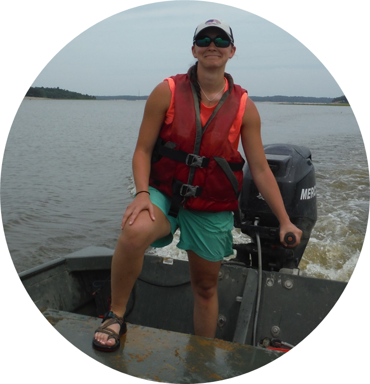

<!--
library(knitr)
rmarkdown::render_site("about.Rmd")# build website
rmarkdown::render_site()# build website
-->


<div style="float: left; width: 100%;"> 
## Principal investigator
</div>

<div style="float: left; width: 33%;"> 
### Michael E. Colvin
```{r echo=FALSE, out.width='90%',fig.align='center'}

```
</div>


<div style="float: left; width: 100%;"> 
## Postdoctoral associates
</div>


<div style="float: left; width: 33%;"> 
### Sara Reynolds
```{r echo=FALSE, out.width='90%',fig.align='center'}

```
dsfgsdfgsdfg
</div> 

<div style="float: left; width: 33%;"> 
### David Schumann
```{r echo=FALSE, out.width='90%',fig.align='center'}

```
dsfgsdfgsdfg
</div> 

<div style="float: right; width: 33%;"> 
<!--open slot--> 
</div>


<div style="float: left; width: 100%;"> 
## Graduate students
</div>

<div style="float: left; width: 33%;"> 
### Giancarlo Coppolla
```{r echo=FALSE, out.width='90%',fig.align='center'}

```
asdfasdf
</div>

<div style="float: left; width: 33%;"> 
### Hunter Hatcher
```{r echo=FALSE, out.width='90%',fig.align='center'}

```
adfasdf
</div>

<div style="float: left; width: 33%;"> 
### Caleb Aldridge
```{r echo=FALSE, out.width='90%',fig.align='center'}

```
asdfasd
</div>


<div style="float: left; width: 33%;"> 
### Brad Richardson
```{r echo=FALSE, out.width='90%',fig.align='center'}

```
</div>

<div style="float: left; width: 33%;"> 
### Chelsea Gilliland
```{r echo=FALSE, out.width='90%',fig.align='center'}

```
</div>

<div style="float: right; width: 33%;"> 
</div>


<div style="float: right; width: 33%;"> 
<!--open slot--> 
</div>
<div style="float: right; width: 33%;"> 
<!--open slot--> 
</div>


<div style="float: left; width: 100%;"> 
## Undergraduate students
</div>

<div style="float: left; width: 33%;"> 
Ashley Shannon
```{r echo=FALSE, out.width='90%',fig.align='center'}

```

</div>
<div style="float: left; width: 33%;"> 
<!--open slot--> 
</div>
<div style="float: left; width: 33%;"> 
<!--open slot--> 
</div>


<div style="float: left; width: 100%;"> 
## Past lab members
</div>

<div style="float: left; width: 33%;"> 
### Amy May
```{r echo=FALSE, out.width='90%',fig.align='center'}

```
</div>

<div style="float: left; width: 33%;"> 
### Christian Shirley
```{r echo=FALSE, out.width='90%',fig.align='center'}

```
</div>

<div style="float: left; width: 33%;"> 
### Maddy Ruble
```{r echo=FALSE, out.width='90%',fig.align='center'}

```
</div>

<div style="float: left; width: 33%;"> 
### Andrew Shamaskin
```{r echo=FALSE, out.width='90%',fig.align='center'}

```
</div>


