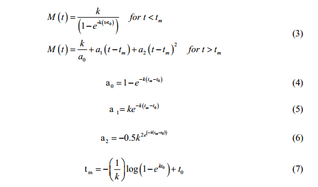

<br>
<br>
<br>
```{r echo=FALSE, out.width="95%"}

```
<!--z

library(knitr)
rmarkdown::render_site()# build website

# rmarkdown::render_site("index.Rmd")# build webpage
  q(save="no")  
-->
## MAIN
Home
Calendar
Contact
CV
Blog
Github
Lab opportunities

## RESEARCH PROJECTS
Paddlefish spawning and use of Noxubee River
Standarized Sampling and Analysis of MDWFP Montioring Data
Evaluating standarized sampling in Kansas Reservoirs
Bull Trout demographic rate esimation
Chinook Prespawn Mortality
Modeling caviar yield
Clear Lake Ecosystem Simulation Project
      -Modeling pulsed harvest systems
      -Controling carp populations by pulsed commercial harvest
      -Consequences of non-native species invasions for
          lake restoration and recreational fisheries
Periodic matrix modeling giant foxtail populations
Malheur National Wildlife Refuge Aquatic Health
Coho salmon and freshwater habitat
Whirling disease in the Pahsimeroi River, ID

## TEACHING, MENTORING, AND WORKSHOPS
Teaching
Mentoring
Workshops

## PUBLICATIONS
Peer reviewed
Technical reports

## PRESENTATIONS
Scientific meetings
Public outreach

## MODELING AND STATISTICS
R
Dynamic simulation
Models Developed

## OTHER STUFF
Archive of other stuff
Bank of fish and fisheries links
