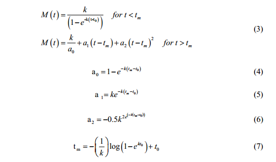

<br>
<br>
<br>
```{r echo=FALSE, out.width="95%"}

```
<!--z

library(knitr)
rmarkdown::render_site()# build website

# rmarkdown::render_site("index.Rmd")# build webpage
  q(save="no")  
-->

## TEACHING, MENTORING, AND WORKSHOPS

### Teaching

### Workshops

#### R Courses taught

* Making scientific graphics in R: Research Advances in Fisheries Wildlife and Ecology (RAFWE) symposium (2 hr), February 2013
			<a href="r/RAFWEWorkshop.zip">Zip file of materials</a></li>
* Intro to R: NREM-GSO Brown Bag (1 hr), February 2011
			<a href="r/20110201materials.zip">Zip file of materials</a></li>
		<li>Routine fisheries analysis using R (1.5 day Continuing education course), July 2009
			<a href="r/200907AFScontEd.zip">Zip file of materials</a></li>
			
		<li>R professional development lunch (1 hr), April 2008:
			<a href="r/littleRpresentation.pdf">Slides</a>, <a href="r/script.pdf">R Script</a></li>
			
		<li> Intro to R: ISU Bird group, November 2011
			<a href="r/birdGroupR.zip">Zip file of materials</a></li>